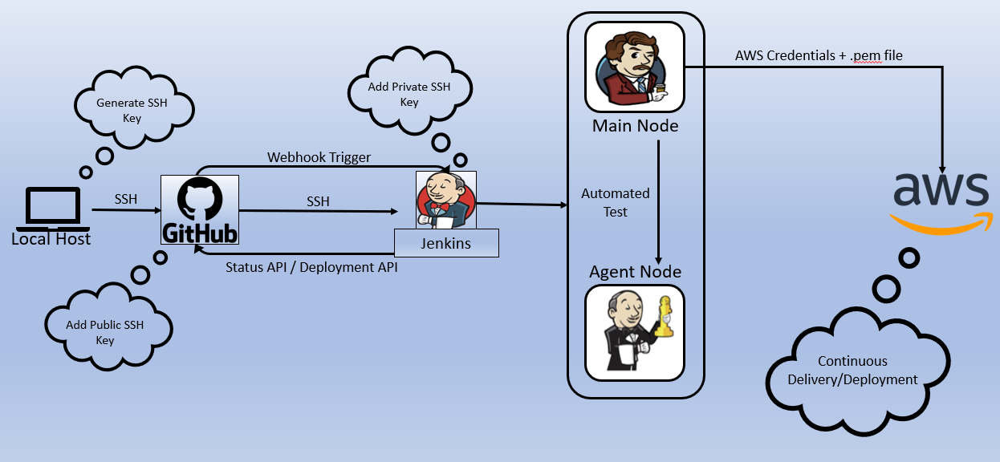

# CI/CD With Jenkins & Amazon Web Service



## Table of Contents
- [CI/CD With Jenkins & Amazon Web Service](#cicd-with-jenkins--amazon-web-service)
  - [Table of Contents](#table-of-contents)
- [Making A SSH Public Key](#making-a-ssh-public-key)
  - [Blocker](#blocker)
- [Jenkins](#jenkins)
  - [Setting Up Github & Webhook](#setting-up-github--webhook)
  - [Continuous Intergration](#continuous-intergration)
    - [First Job](#first-job)
    - [Second Job](#second-job)
    - [Third Job](#third-job)

# Making A SSH Public Key
- Make sure you run gitbash as admin
- `cd ~/.ssh`
- `ssh-keygen -t rsa -b 4096 -C "yourgitemail@hotmail.co.uk"`
- After you press enter it will ask you "Enter file in which to save the key" and show you the file path of where it will save it by default if you do not change it. For the name I put `103a` and pressed enter
- It then ask "Enter passphrase (empty for no passphrase)" So you press enter twice and keep it empty
- This will then create two files in your .ssh folder `103a` and `103a.pub`
- After this you will want to `cat 103a.pub` and copy the information of this file exactly how it is.
- You will then take this copy over to github > `settings` >  `SSH and GPG keys` > `New SSH key` >  Enter a name of your choice `eng103a` > Paste the key of `103.pub`
- You can then create a new repository `CICD`
- Once you create a new repository follow the steps on github of setting it up using the `ssh` link and not the `https`.

## Blocker
- When setting up the repository I kept getting access denied. I thought it was to do with my ssh key being copied wrong onto github however the issue was to do with my gitbash terminal not identify my email. The way I fixed this was by using the command `eval "$(ssh-agent -s)"` and then `ssh-add ~/.ssh/103a` and this added my email identity.  

[Back](#table-of-contents)

# Jenkins
## Setting Up Github & Webhook
- Create a new repo with the app data inside and sync it to your localhost.
- To do this we need to run this command in the ~/.ssh file path. `ssh-keygen -t ed25519 -C "yourgitemail@yourgitemail.com"` just like above but name the file something different for example `103a-jenkins`.
- Then follow the steps above on how to add this ssh key onto github
- Now to setup the webhook on the repository we have just created click on `settings` > `Webhooks` > `Add Webhook`
- For Payload URL: "jenkinsIP`/github-webhook/`"
- Content Type: `application/json`
- Which events would you like to trigger this webhook: `Just the Push Event`

## Continuous Intergration 
### First Job
- In this example we will be creating 3 Jenkins jobs in order to have an automated upload of the code we have changed onto our EC2 instance.
- So first we must create a dev branch on github, this is done by using `git checkout -b dev`. The reason why we want to create a dev branch is because editing code should be done on a different branch that should only be merged with the main branch once it is tested or checked by senior staff.
- After this is created we can go to Jenkins and create our first job `new item` > `armaan-ci` > `Freestyle Project`
- We can then configure this job:
  - Tick `Discard Old Builds` and enter `3` for `Max # Of Builds To Keep`
  - Tick `Github Project` and enter the `HTTPs` repository link and not the SSH
  - Tick `Restrict Where This Project Can Be Run` > Enter `sparta-ubuntu-node`
  - Tick `git` > for `repository url` enter your `SSH` repository Link > For `Credentials` click `Add` > `Jenkins` > Change `Kind` to `SSH username with private key` > Enter the `keyname` for username > In `private key` click `enter directly` and add your private key into this area.
  - In `Branches to build` change */master to `*/dev`
  - Under `Build Environment` tick `provide node & npm bin/folder to PATH`
  - Under `Build` select `Execute Shell` and shell you want to put:
```
cd app/test
npm test 
```
- Finally apply and save. You will have to come back and add a `Post-Build Action` and link it to the second job once its created

### Second Job
- This job will merge the dev branch to the main branch after the first job is successful which is good because if the code isnt passing the test it should not be merged with main
- Create a second job by clicking `new item` > `armaan-merge` > `Freestle Project`
- We can then configure this job:
  - Tick `Discard Old Builds` and enter `3` for `Max # Of Builds To Keep`
  - Tick `Github Project` and enter the `HTTPs` repository link and not the SSH
  - Tick `Restrict Where This Project Can Be Run` > Enter `sparta-ubuntu-node`
  - Tick `git` > for `repository url` enter your `SSH` repository Link > For `Credentials` click `Add` > `Jenkins` > Change `Kind` to `SSH username with private key` > Enter the `keyname` for username > In `private key` click `enter directly` and add your private key into this area.
  - In `Branches to build` change */master to `*/dev`
  - Under `Build Environment` tick `provide node & npm bin/folder to PATH`
  - Under `Build` select `Execute Shell` and shell you want to put:
```
git checkout main
git pull origin main
git merge origin/dev
git push origin main
```
- Finally apply and save. You will have to come back and add a `Post-Build Action` and link it to the third job once its created. However you can test to see if the two jobs are working by changing the readme on github on the dev branch and seeing if it changes the main branch as well as see the output console of Jenkins

### Third Job
- For this job we will need to create a new EC2 instance using our own VPC and subnet as well as the same security group with another inbound rule: `SSH` with the CIDR:"`JenkinsIP`/32"
- Once we created this instance with the right security groups we can create the third job on Jenkins and configure it again:
  - Configure the job the same way as the second job however change the dev branch to main branch `*/main` and change the information in the `Execute Shell`:
```
scp -o "StrictHostKeyChecking=no" -v -r app ubuntu@IP:~ 
ssh -o "StrictHostKeyChecking=no" -v -tt ubuntu@IP << EOF
cd app 
sudo apt-get update -y
sudo apt-get upgrade -y
sudo apt-get install nginx -y
curl -sL https://deb.nodesource.com/setup_6.x | sudo -E bash -
sudo apt-get install -y nodejs
npm install
screen -d -m npm start
exit

EOF
```

[Back](#table-of-contents)